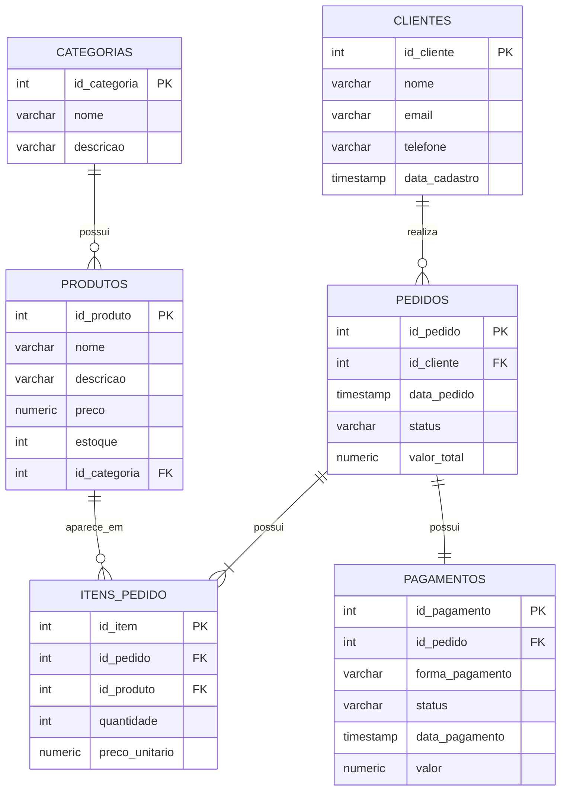

# Banco de Dados de E-commerce

Projeto prático de banco de dados relacional desenvolvido para simular a estrutura básica de um e-commerce.

O projeto foi criado com foco na prática de modelagem de dados e SQL, passando pela criação das tabelas, relacionamentos, inserção de dados e consultas para análise das vendas.

## Objetivo

Construir um banco de dados capaz de armazenar e relacionar informações de:

- Clientes
- Categorias
- Produtos
- Pedidos
- Itens dos pedidos
- Pagamentos

Além da estrutura do banco, o projeto possui consultas SQL para responder algumas perguntas relacionadas às vendas.

## Tecnologias utilizadas

- PostgreSQL
- SQL
- GitHub

## Estrutura do projeto

```text
ecommerce-database/
│
├── docs/
│   └── modelagem.md
│
├── sql/
│   ├── 01_create_tables.sql
│   ├── 02_insert_data.sql
│   ├── 03_queries.sql
│   └── 04_views.sql
│
└── README.md
```

### Arquivos SQL

**01_create_tables.sql**

Criação das tabelas, chaves primárias, chaves estrangeiras e regras de validação.

**02_insert_data.sql**

Dados fictícios utilizados para testar o banco e executar as consultas.

**03_queries.sql**

Consultas SQL básicas e consultas voltadas para análise das vendas.

**04_views.sql**

Views utilizadas para facilitar a consulta de informações relacionadas aos pedidos e itens vendidos.

## Estrutura do banco

O banco possui seis tabelas principais:

- `clientes`
- `categorias`
- `produtos`
- `pedidos`
- `itens_pedido`
- `pagamentos`

Os principais relacionamentos são:

- Um cliente pode realizar vários pedidos.
- Um pedido pertence a um cliente.
- Um pedido pode possuir vários itens.
- Um produto pode aparecer em vários pedidos.
- Cada produto pertence a uma categoria.
- Cada pedido possui um pagamento.

## Diagrama do banco de dados



## Consultas desenvolvidas

Durante o projeto foram criadas consultas para:

- Listar clientes e produtos
- Filtrar produtos por preço
- Ordenar produtos por valor
- Consultar pedidos por status
- Relacionar clientes e pedidos
- Consultar produtos presentes em cada pedido
- Calcular o faturamento
- Calcular o ticket médio
- Identificar os produtos mais vendidos
- Calcular o valor vendido por produto
- Calcular o total gasto por cliente
- Contar produtos por categoria

### Produtos mais vendidos

```sql
SELECT
    produtos.nome AS produto,
    SUM(itens_pedido.quantidade) AS quantidade_vendida
FROM itens_pedido
INNER JOIN produtos
    ON itens_pedido.id_produto = produtos.id_produto
GROUP BY produtos.nome
ORDER BY quantidade_vendida DESC;
```

### Total gasto por cliente

```sql
SELECT
    clientes.nome AS cliente,
    SUM(pedidos.valor_total) AS total_gasto
FROM clientes
INNER JOIN pedidos
    ON clientes.id_cliente = pedidos.id_cliente
GROUP BY clientes.nome
ORDER BY total_gasto DESC;
```

### Faturamento dos pedidos pagos

```sql
SELECT
    SUM(valor_total) AS faturamento_total
FROM pedidos
WHERE status = 'Pago';
```

## Views

O projeto possui duas views para facilitar algumas consultas.

### `vw_resumo_pedidos`

Reúne os dados dos pedidos com o nome dos respectivos clientes.

Exemplo de consulta:

```sql
SELECT *
FROM vw_resumo_pedidos;
```

### `vw_detalhes_vendas`

Reúne informações de clientes, pedidos e produtos, incluindo quantidade, preço unitário e subtotal de cada item.

Exemplo de consulta:

```sql
SELECT *
FROM vw_detalhes_vendas;
```

## Conceitos praticados

Neste projeto foram utilizados:

- Modelagem de banco de dados relacional
- Chaves primárias (`PRIMARY KEY`)
- Chaves estrangeiras (`FOREIGN KEY`)
- `NOT NULL`
- `UNIQUE`
- `CHECK`
- `INSERT`
- `SELECT`
- `WHERE`
- `ORDER BY`
- `INNER JOIN`
- `LEFT JOIN`
- `GROUP BY`
- `SUM`
- `AVG`
- `COUNT`
- Views

## Como executar

Os scripts devem ser executados em um banco PostgreSQL na seguinte ordem:

```text
1. sql/01_create_tables.sql
2. sql/02_insert_data.sql
3. sql/03_queries.sql
4. sql/04_views.sql
```

Os dois primeiros scripts criam a estrutura do banco e inserem os dados de exemplo.

O arquivo `03_queries.sql` contém as consultas utilizadas para explorar os dados.

O arquivo `04_views.sql` cria as views do projeto.

Após a criação das views, elas podem ser consultadas com:

```sql
SELECT * FROM vw_resumo_pedidos;

SELECT * FROM vw_detalhes_vendas;
```

## Status do projeto

Projeto concluído para fins de estudo e portfólio.
